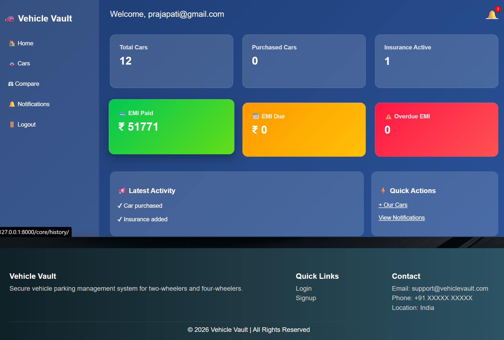

🚗 Vehicle Vault

Vehicle Vault is a full-featured Django-based web application that allows users to explore, purchase, and manage cars with advanced features like EMI payment, insurance, test drives, and purchase history.

---

📌 Features

🚘 Car Management

- Browse available cars
- View detailed car information
- Compare multiple cars

🛒 Purchase System

- Add to cart functionality
- Buy car directly
- Invoice generation after purchase

💳 EMI System

- Buy cars using EMI
- Monthly EMI calculation
- EMI payment system
- EMI history tracking

🛡️ Insurance System

- Buy insurance for cars
- Dynamic premium calculation
- Insurance history tracking
- Insurance invoice generation

📅 Test Drive Booking

- Schedule test drives
- Pickup location support
- Email confirmation system

🔔 Notifications

- Notifications for car purchase
- Notifications for insurance purchase

👤 User Authentication

- Signup & Login & Logout system
- Email verification
- Forgot & Reset Password (custom UI based)

📊 User Dashboard

- Purchase history
- EMI history
- Insurance history
- Notifications

---

🛠️ Tech Stack

- Backend: Django (Python)
- Frontend: HTML, CSS, Javascript
- Database: Postgrsql
- Payment Integration: Razorpay (Configured)
- Email System: Django Email Backend

---

📂 Project Structure

Vehicle-vault13-main/
│
├── core/                # Main app (models, views, logic)
├── templates/           # HTML templates
│   ├── emi/
│   ├── insurance/
│   ├── password/
│   └── ...
├── static/              # CSS files
├── media/               # Car images
├── vehiclevault/        # Project settings
├── manage.py
└── db.sqlite3

---

⚙️ Installation & Setup

1️⃣ Clone the Repository

git clone https://github.com/your-username/Vehicle-vault13.git
cd Vehiclevault

2️⃣ Create Virtual Environment

python -m venv venv
venv\Scripts\activate   # Windows

3️⃣ Install Dependencies

pip install -r requirements.txt

4️⃣ Run Migrations

python manage.py makemigrations
python manage.py migrate

5️⃣ Run Server

python manage.py runserver

---

💳 Razorpay Setup

- Go to Razorpay Dashboard
- Get API Key & Secret
- Add in "settings.py"

RAZORPAY_KEY = "your_key"
RAZORPAY_SECRET = "your_secret"

---

📸 Screens Included

- Home Page
    
- Car Listing
    
- Car Details
    
- Cart Page
    
- EMI Page
    
- Insurance Page
    
- Payment Success Page
    
- Dashboard
    

---

🤝 Contributing

Feel free to fork this repository and contribute by submitting a pull request.

---

📧 Contact

For any queries or suggestions:

- Email: xxyz33301@gmail.com

---

⭐ Show Your Support

If you like this project, please ⭐ the repository!

---

👤 Author

Parth Prajapati

---